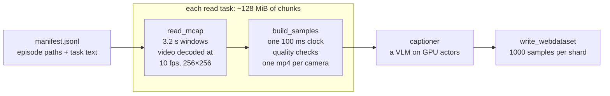

# From robot recordings to labeled training clips with `ray.data.read_mcap`

We build a lot of vision-language and world-model data pipelines on
[Ray Data](https://docs.ray.io/en/latest/data/data.html). With robot data, we
kept writing the same boilerplate around [MCAP](https://mcap.dev) files:

- work out which files, and which parts of them, hold the topics we need;
- give each file to a worker, which then reads all of it;
- cut the messages into clips;
- go back for the keyframe each clip's video needs, then decode, downsample and resize;
- line the cameras and the joint data up on one clock;
- and, when a long job dies, work out which clips were already done.

It was a lot of code, and the subtle parts were easy to get wrong. So we built
them into the reader. `ray.data.read_mcap` now hands you **clips**: a time
window of every topic you select, with the video already decoded, downsampled
and resized. You write only the step that turns a clip into a training sample.
The reader is flexible enough to cover these pipelines, and tuned for fleets of
recordings.

This repo shows it doing a real job: turning robot episodes into auto-labeled
training samples, the kind that robot world models and policies learn from.

> **Status: preview.**
> `read_mcap` exists in Ray today and returns one row per message. The redesign
> is in review as three stacked Ray PRs:
> [#66654](https://github.com/ray-project/ray/pull/66654),
> [#66655](https://github.com/ray-project/ray/pull/66655) and
> [#66670](https://github.com/ray-project/ray/pull/66670).
> The code here uses the API as it will be once they merge. Names may still
> change in review.

## What's here

| File | What it is |
|---|---|
| [`e2e_vlm.py`](e2e_vlm.py) | A complete pipeline. MCAP episodes become 3.2 s clips of two cameras plus joint state and commands, on one 100 ms clock. Then quality checks, VLM captions, and WebDataset shards. It also writes synthetic episodes, so it runs on a laptop in seconds. |
| `README.md` | This page: how the reader works, and why each part is there. |

## The idea in 30 seconds

```python
import ray
from ray.data.datasource import VideoOptions, WindowSpec

clips = ray.data.read_mcap(
    episode_paths,  # a list from your catalog: no bucket listing
    topics=["/camera/front/video", "/camera/wrist/video",
            "/robot/joint_states", "/robot/joint_commands"],
    read_granularity="window",  # one row per clip
    window=WindowSpec(length_s=3.2, anchor="epoch", drop_partial=True),
    video=VideoOptions(fps=10, resize=(256, 256)),  # decoded inside the read
    include_row_id=True,  # a stable id per clip, for exact resume
)
```

Each row is one 3.2 s clip of one episode:

| Column | Holds |
|---|---|
| `path`, `window_start`, `window_end` | Where the clip comes from. Times are in nanoseconds, end exclusive. |
| `frames:/camera/front/video` | The clip's frames: `uint8`, shape `(n, 256, 256, 3)`. Every frame is complete. |
| `frame_times:/camera/front/video` | The log time of each frame. |
| `topic`, `log_time`, `data`, ... | Every other message in the clip, in time order, still encoded. |
| `channels` | The schema of each topic in the row, so the row decodes on its own. |
| `row_id` | The clip's id. It is the same on every run, however the read is split. |

You write no listing, index reading, seeking, keyframe hunting or decoder
bookkeeping.

## What it does that you would otherwise hand-roll

| Hand-rolled, you have to... | `read_mcap` does this instead |
|---|---|
| open every file to learn what is in it | It plans from each file's index. Files without your topics or time range are dropped before any message is read. |
| read whole files, including topics you don't need | It reads only the chunks that hold your topics and time range. |
| give one file to one worker, so one long recording stalls the job | It packs chunks into read tasks of about 128 MiB. Long recordings split across many tasks, and short ones share a task. |
| find the keyframe before each clip, or get broken frames | It reads back to the last keyframe, primes the decoder, and drops the extra frames. |
| make sure a clip cut across two workers comes out once | Each clip has exactly one owner task, which reads on into the next chunk to finish it. |
| downsample frames the same way on every worker | Frames are thinned on a fixed time grid, so the result does not depend on the split. |
| ship raw frames between steps | Frames are decoded and resized inside the read task, and your next step runs in that same task. |
| track which clips are done | Each clip has a stable `row_id`. With Ray Data checkpointing, a rerun redoes only the missing clips. |

The next section explains each one.

## How it works

### 1. Plan from the index, never from the data

An MCAP file stores its messages in compressed **chunks**. At its end, a
**summary** lists every topic and indexes every chunk: where it is, its size,
its time range and which topics are inside. The reader plans the whole job
from these summaries.

- A file with none of your topics, or no messages in your time range, is
  dropped before any of its messages are read.
- Inside a file, only the chunks that can hold your topics and time range are
  read. If your recorder keeps cameras and other sensors in separate chunks, a
  job that needs only the joints never downloads video.
- Pass `read_mcap` a list of paths, for example from your data warehouse. It
  then skips the bucket walk, and up to 200 listing tasks read summaries in
  parallel, 16 at a time each.

### 2. Split long recordings, pack short ones

Read tasks are made of chunks, not files. Chunks are packed into tasks of about
128 MiB of uncompressed data, in file order.

```
files and their chunks                  read tasks (~128 MiB each)

long.mcap    [c][c][c][c][c][c][c][c] -> task 1: long [c][c][c][c]
                                         task 2: long [c][c][c][c]
short1.mcap  [c][c]                   -> task 3: short1 [c][c], short2 [c], short3 [c][c]
short2.mcap  [c]
short3.mcap  [c][c]
lidar.mcap   (no selected topic)      -> dropped while planning, never read
```

A ten-hour recording no longer pins one worker while the rest of the cluster
waits. A thousand short episodes don't become a thousand tiny tasks.

### 3. Every clip complete, every clip exactly once

Splitting a recording raises two problems. The reader solves both.

**A clip can straddle two tasks.** Each window has one owner: the task that
holds the chunk where the window starts. That task reads on into the next chunk
to finish the window. Every task works this out from the same summary, so each
clip is emitted exactly once.

```
time (s)   0               3.2             6.4             9.6
chunks     |chunk 1 (task A)        |chunk 2 (task B)        |
windows    [w0            )[w1            )[w2            )

           w0 starts in chunk 1: task A emits it.
           w1 also starts in chunk 1: task A emits it, reading on into chunk 2.
           w2 starts in chunk 2: task B emits it.
```

**Video needs the frames before it.** H.264 and similar codecs store a full
picture only at **keyframes**. The frames in between store only changes. So a
clip that starts between keyframes cannot be decoded on its own. The reader
reads back to the last keyframe before the clip, decodes those frames to prime
the decoder, and drops them.

```
K = keyframe, p = a frame that stores only changes

camera     K  p  p  p  p  K  p  p  p  p  K  p  p  p  p  K
clip                               [------------------------ ...
lead-in                   [--------)
                          decoded to prime the decoder, then dropped
```

- The look-back is capped at 10 s (`RAY_DATA_MCAP_MAX_LEAD_IN_S`). With no
  keyframe in that span, the camera's frames are skipped until its next
  keyframe. You never get a half-decoded frame.
- Video topics are recognized by schema name: Foxglove `CompressedVideo` and
  `CompressedImage`, and ROS `sensor_msgs/CompressedImage`. Any other topic can
  be listed in `video_topics`.
- The codec comes from the message's `format` field, or from the bytes
  themselves: JPEG, PNG, H.264, H.265, VP9 and AV1. Keyframes are found in the
  bytes too.
- Each frame is matched to its message by log time, even when the decoder
  reorders frames (B-frames) or holds them back.

### 4. Decode inside the read task, at training size

- Each camera gets one decoder per task, and overlapping windows share its
  frames.
- `fps=10` keeps at most one frame per 100 ms of log time. The 100 ms grid is
  aligned to the Unix epoch, so the same frames are kept however the job is
  split. With `anchor="epoch"`, windows start on that grid too, so a 3.2 s
  window has exactly 32 frame slots.
- `resize=(256, 256)` shrinks frames before they leave the task.
- A window is emitted as soon as it is complete, so a task holds only a few
  windows of frames at a time.
- Ray Data fuses a CPU step that follows the read, such as building your
  sample, into the read task. Raw frames never cross the network: only small
  mp4s and arrays do.

### 5. Rerun after a crash, and redo only what's missing

A clip's `row_id` names its file and its window, plus a hash of the read
options that change its content (topics, time range, video settings):

```
s3://fleet/ep_0412.mcap#[1760000003200000000,1760000006400000000)@a72a9cb4
```

The id does not depend on how the read was split. Ray Data's checkpointing
records the ids of the samples it has written, and a rerun skips them. Change
the topics or the frame rate and the ids change, so an old checkpoint never
hides new work.

### 6. Guard rails

- Message payloads use 64-bit Arrow offsets, so heavy rows never hit Arrow's
  2 GiB limit.
- A row over 1 GiB (`RAY_DATA_MCAP_MAX_ROW_BYTES`) fails the read with a
  message that says how to make it smaller, before it can exhaust a worker's
  memory.
- A file without a summary or chunk index is still read, whole, by one task.

## Measured

| What | Result |
|---|---|
| A public 845 MB ROS 2 recording: 105 s, two 1280×1024 JPEG cameras and an IMU. Read as 33 windows of 3.2 s, both cameras decoded to 256×256 at 10 fps. Laptop, 8 CPUs. | One task for the file: **18.9 s**. Split into chunk tasks: **4.4 s**. Every column of the output is identical. |
| One camera's 3.2 s window, as it leaves the read task | 6.3 MB of raw frames, or **78 KB** as the clip's mp4 (24 ms to encode) |
| The script's synthetic demo, killed while processing its third episode, then rerun | The rerun wrote only the **6** missing clips. The result is byte-identical to an uninterrupted run. |

## The sample-prep pipeline

`e2e_vlm.py` turns episodes into training samples:



1. **Read.** `read_mcap` as above, over the episode paths in the manifest.
2. **Build a sample** (`build_samples`, inside the read task). Each window
   becomes 32 slots of 100 ms:

   ```
   slot        0          1          2         ...   31
   front       f          f          f               f    the frame logged in the slot
   wrist       f          -          f               f    "-": no frame, so repeat the last one; mask is False
   state       s          s          s               s    joint positions, interpolated at the slot start
   actions     a a a a a  a a a a a  a a a a a       ...  the command in force at each 20 ms step (50 Hz)
   ```

   Then come cheap quality checks and one H.264 mp4 per camera. The mp4 has a
   keyframe at frame 0 and no B-frames, so frame *k* is slot *k* and every clip
   decodes on its own.
3. **Caption** (`vlm_captions`). [Ray Data LLM](https://docs.ray.io/en/latest/data/working-with-llms.html)
   runs vLLM on GPU actors. Each prompt is the episode's task text plus 4
   frames per camera. The answer is constrained to a JSON schema: summary,
   action, objects, outcome and quality problems. On a laptop, a CPU stub
   takes the VLM's place.
4. **Write.** WebDataset tar shards, one sample per clip.

One sample:

| File | Shape | What |
|---|---|---|
| `front.mp4`, `wrist.mp4` | 32 frames, 256×256, 10 fps | One per camera. Frame *k* is slot *k*. |
| `actions.npy` | `(32, 5, 2)` float32 | The joint command in force at each 20 ms step. |
| `state.npy` | `(32, 2)` float32 | Measured joint positions at each slot start. |
| `mask.npy` | `(32, 2)` bool | Whether each camera had a real frame in each slot. |
| `json` | | Source path, window, quality checks and caption. |
| `row_id` | | The clip's id, which checkpointing uses. |
